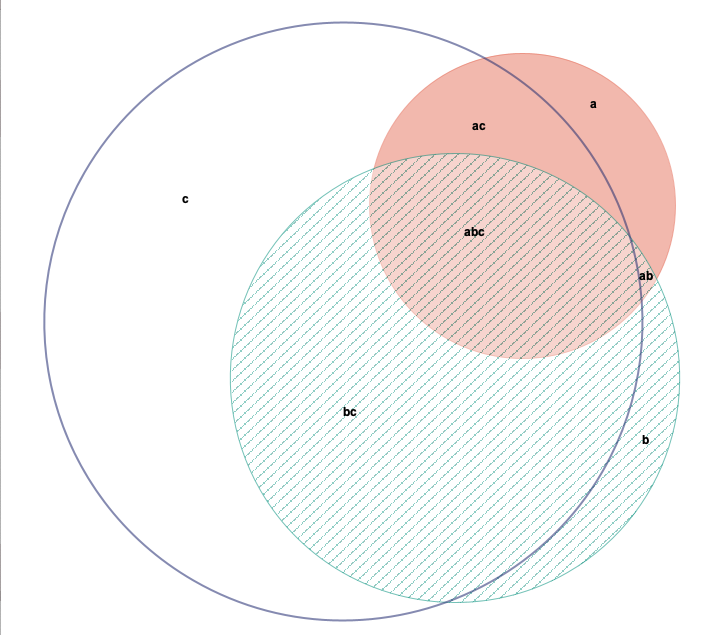

## Detection of AMR genes on Nanopore uncorrected reads

### Tools

* Abricate (CARD built-in database)
* MiniMap2 (CARD nt database)
* Kraken2 (formatting a CARD nt database)

### Overlap


| Count | Files                       |
| ----: | :-------------------------- |
|  3634 | Kraken2,                    |
|  3594 | Kraken2, MiniMap2           |
|  1014 | Abricate, Kraken2, MiniMap2 |
|   812 | Abricate, Kraken2,          |
|   221 | MiniMap2                    |
|    41 | Abricate,                   |
|     6 | Abricate, MiniMap2          |




### Speed

For the two faster approaches (MiniMap2 and Kraken2), peak memory usage is also reported.

```
Benchmark #1: abricate --db card reads.fq.gz
  Time (mean ± σ):     364.373 s ± 20.665 s 
  Range (min … max):   338.193 s … 394.492 s    10 runs
 
Benchmark #2: kraken2 --db kCard reads.fq.gz --threads 1
  peak=35228 
  Time (mean ± σ):     39.239 s ±  0.359 s
  Range (min … max):   38.907 s … 40.073 s    10 runs
 
Benchmark #3: minimap2 -t 1 -ax map-ont card.mm reads.fq.gz
  peak=814228
  Time (mean ± σ):     31.056 s ±  2.044 s
  Range (min … max):   27.032 s … 33.136 s    10 runs
 
Summary
  'minimap2' ran
    1.26 ± 0.08 times faster than 'kraken2'
   11.73 ± 1.02 times faster than 'abricate'
```


_Andrea Telatin, 18 November 2021_